#                            无名创新多功能开源遥控器用户手册

​        本款结合遥控器+数传+地面站三合一多功能手持终端（简称HGS_3IN1）开源产品是武汉无名创新科技有限公司继以往开源产品：**开源飞控、开源QT地面站、开源机器视觉**后的又一全新力作，旨在为广大无人机学习者提供完备的一站式无人机学习方案，为萌新进阶成为无人机**“全栈工程师”**铺路。

## 1、通讯模块介绍

​        HGS_3IN1采用基于NRF24L01+PA+LNA的大功率、高灵敏度的2.4G无线模块，增加了大功率RFX2401C功放芯片和LNA芯片、射频开关与带通滤波器使得模块可以实现远距离传输，最大空中传输速率为2Mbps，多频点可以满足多点通讯和调频通讯。

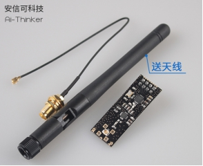

​        接收机+数传端采用集成的无线射频模块ML01SP4，该模块采用原装进口芯片nRF24L01+PA，高精度电阻、电容、电感贴片制作，带金属屏蔽罩，保障在无人机空中端遭遇极端复杂电气条件下的稳定数据传输。

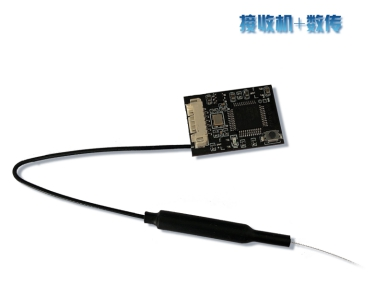

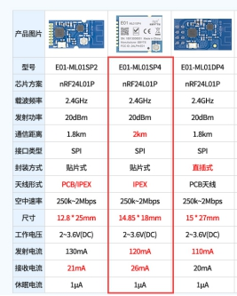

## 2、遥控器硬件资源与接口介绍

​        遥控器采用主控芯片主流增强型ARM Cortex-M3 MCU的32位微处理器STM32F103RBT6，主频72MHz，芯片具有128 KB Flash与20KB SRAM，两个12位ADC，三个通用16位定时器以及一个PWM定时器，配备标准和高级通信接口：两个I2C和SPI，多达5路串口，一个USB和一个CAN等。同时遥控器配备有2K外部EEPROM用于存储设置数据，实现用户操作记忆功能。

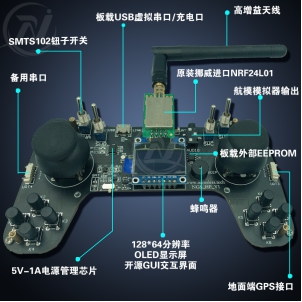

​        遥控器自带5V/1A电源管理芯片，可以直接插入MICRO USB口对遥控器电池进行充电，配备880mAh大容量锂电池，满电状态下可以实现长达600分钟的持久工作。

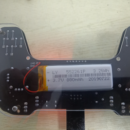

​        配备128*84分辨率的OLED显示屏，配合遥控器开源GUI系统，可以实现人机友好的交互。

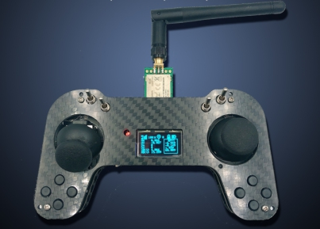

​        配备0955袖珍版蜂鸣器用于配合按键实现单击、长按、保存已经特殊状下的报警功能。

​        配备横滚、俯仰、油门、偏航方向杆电位器，另外上方分布有SWA、SWD、SWC、SWD四路两档钮子开关，以及左右2个输出模拟量的拨盘电位器电位器VRA、VRB。

​        针对初学者用航模模拟器飞行，遥控器配备有AUDIO 3.5mm音频耳机口，用于连接电脑音频或者加密狗实现PC端的模拟飞行操作。

​        遥控器USB虚拟串口、URT1串口可以用于透明传输数传端的数据给地面站，配合无名创新开源地面站可以实现状态显示、数据波形、参数调试、飞控校准、基本串口收发等功能。

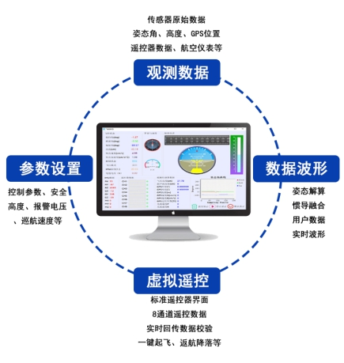

​        串口3用于连接GPS模块，遥控器可以将自身解析到的GPS数据发送至飞控端，实现无人机的打点飞行与动态追踪地面端物体等功能，串口4为备用串口，LINK接口用于SWD下载调试接口。

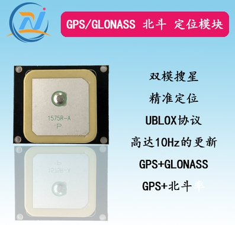

​        板载8个独立按键用于实现显示屏翻页、参数更改、参数保持、恢复默认等，下面列出每个按键的功能。

| 按键 | 短按         | 长按         |
| ---- | ------------ | ------------ |
| K1   | 无           | 无           |
| K2   | 参数单次自加 | 参数连续自加 |
| K3   | 无           | 发送GPS数据  |
| K4   | 参数单次一次 | 参数连续自减 |
| K5   | 向上翻页     | 恢复默认参数 |
| K6   | 切上一行     | 无           |
| K7   | 向下翻页     | 保存当前参数 |
| K8   | 切上下行     | 无           |

## 3、遥控器常规操作与设置

### 3.1 遥控器与接收机的对码

​        接收机进入对码状态需要在接收机上电的同时按下接收机对码按键，接收机指示灯会进入快闪状态。

​        遥控器进入对码状态操作如下，在遥控器关机状态下保持按键K7持续按下，然后打开遥控器开关，遥控器会进入对码状态，RGB状态指示灯红灯进入闪烁状态。对码成功后蜂鸣器会长“哔”一声随即进入正常工作界面。

​        遥控器进入对码状态后会根据芯片ID生成的唯一的遥控器频道+通讯地址发送到当前正处于对码状态的接收机，遥控器连续成功解析到发送成功标志位后，会自动对码成功。接收机接收到该遥控器频道与通讯地址后，会将数据保存在内部FLASH里。后续接收机正常上电时会读取频道、地址数据并配置NRF，从而实现与遥控器的配对。

### 3.2 主页关键数据显示

​        遥控器主页主要显示和通讯连接质量、GPS定位星数，解锁状态、电池电量、飞行高度/半径、爬升/巡航速度、姿态角、温控系统温度等关键数据，界面如下。

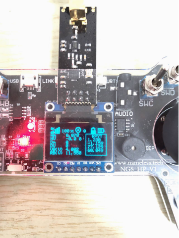

### 3.3 通讯频道与地址的设置

​        遥控器默认通讯频道与地址是根据芯片唯一ID生成的，当同一环境下存在多个设备处于同一或者相近设备时，数据可能会存在干扰，因此当发现遥控器与接收机在近距离无遮挡状态下，通讯信号模拟RSSI不为100%时，可以手动调整通讯频道或者通讯地址。设置界面如下：

|  |  |
| ------------------------------------------------------------ | ------------------------------------------------------------ |
|                                                              |                                                              |

### 3.4 失控保护设置

​        遥控器失控保护用于在遥控器与接收机通讯完全丢失或者通讯RSSI小于15%时，强制使遥控器某一通道输出预先设定的失控值，飞控程序可以判断此通道数据，做出自动返航、原地降落等操作。通常做法是将此通道序号和通道值与飞控一键返航通道对应，也可以单独判断。

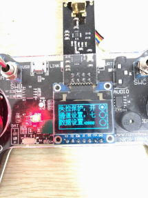

### 3.5 低压报警

​        低压报警用于设置遥控器安全电量与飞行器安全电量，实时判断当前电压值，当电压低于设定安全值时，遥控器蜂鸣器会鸣响，用于提示操作者及时执行返航、降落操作。

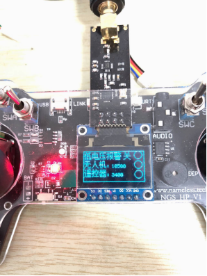

### 3.6 模式通道设置

​        功能模式通道影射设置用于对遥控器输出的5、6、7、8、9、10通道顺序进行设置，其中每一个通道可选择的有开关挡位SWA、SWB、SWC、SWD以及模拟通道VRA、VRB，用户可以根据实际飞行器模式自行映射。

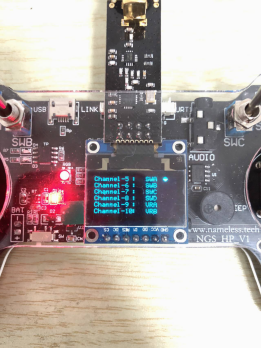

### 3.7 方向通道行程与偏移设置

​        针对遥控器前四个通道可以对行程与偏移进行设置，其中偏移可设置范围为[-100,100]，行程最小值设置范围为[900,1500]，行程最小值设置范围为[1500,2100]，需要调整的范围比较大时，可以长按加减按键，时间越长加减速度越大。

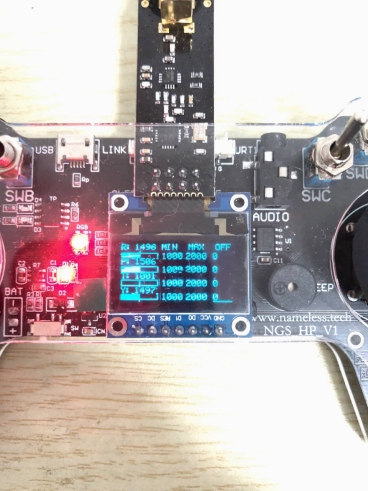

​        **需要注意的是上述所有设置操作，需要长久保存即断电重启后仍然保存上次设置时，在设置完毕后需要长按K7进行保存，否则仅当次有效。需要恢复默认参数时，长按K5按键即可恢复出厂默认参数。**

### 3.8 其它数据页

​        用户数据通道显示、IMU数据显示、GPS定位雷达显示、板载GPS数据显示等界面如下：

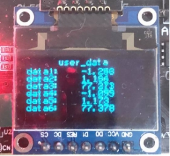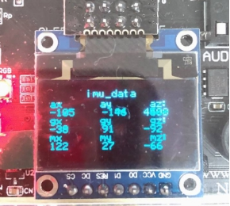

## 4、接收机与数传的使用

​        当仅作为接收机使用时，只需要将配送的连接线焊接到模块背面焊盘上，黑色线接GND(标号GD)，红色线接5V，白色线根据实际飞控支持的信号类型选择PPM(标号PM)或者SBUS(标号SB)焊点，最终完成图如下：

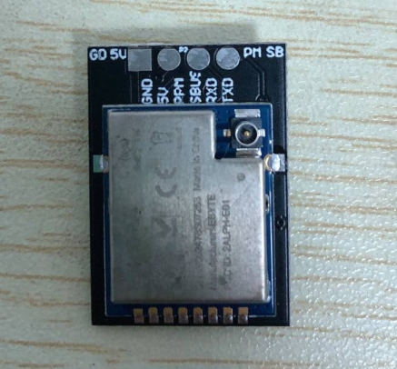

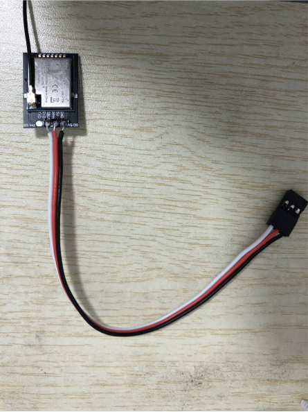

​        同时接收模块同时支持串口透明传输功能，由于NRF24L01单次数传最大数据量为32字节，所以在作为透传功能时，单帧数据不要超过32个，否者数据通讯会阻塞，影响最终通讯质量。当接收机端透传串口接无名创新系列飞控产品时，无名创新TI全系列开源飞控产品如下：

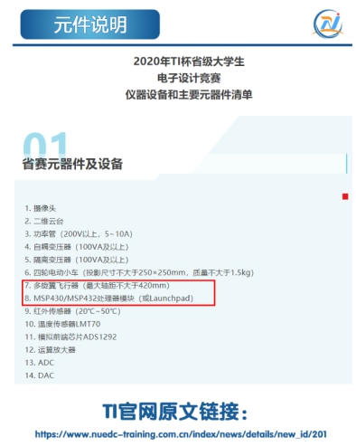

| 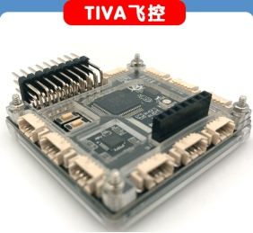 |                |
| ------------------------ | -------------------------------------- |
|  | 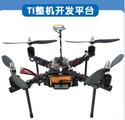 |

​        遥控器端可以通过USB虚拟串口、串口1输出对应透传数据，接无名创新地面站时即可实现无线串口数据传输功能。

本文附录：

遥控器开源资料github链接：

https://github.com/wustyuyi/HGS_HP

遥控器功能演示教程：

https://www.bilibili.com/video/BV1Gz4y1Q7gn

无名创新开源地面站教程：

https://blog.csdn.net/u011992534/article/details/105341638/

无名创新追梦者H7高阶开源飞控学习平台DreamerPilot(主控STM32H743VIT6)

https://www.bilibili.com/video/BV19T4y1L7j9#reply3509591146

https://www.bilibili.com/video/BV1Pi4y1u7Rd

追梦者H7高阶开源飞控 双IMU冗余 

加速度计/陀螺仪:BMI088、ICM20689 

磁力计:IST8310、AK8975 气压计:SPL06、FBM320 

主要核心算法 姿态解算+组合导航:扩展卡尔曼滤波(EKF) 

控制算法:ADRC+PID

 传感器滤波:8KHz采样+高阶数字滤波(低通、带阻) 

传感器故障诊断:动态实时监测均方根误差、方差等，选择最优融合方案 

支持多款地面站:无名地面站+MP/QGC 支持室内外光流/GPS定点、雷达地形跟踪、定速巡航、航点航线飞行、SDK指令控制模式

